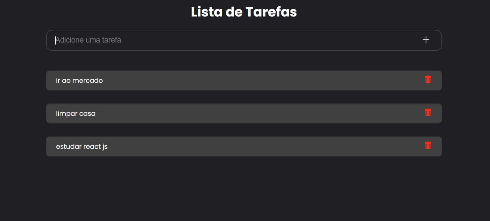

# Todo List
O todo list é um projeto idealizado para organizar as tarefas do seu dia a dia  

## Deploy no Netlify
<https://todo-list-liviaaraujo.netlify.app/>

## Tecnologias

Esse projeto foi desenvolvido com as seguintes tecnologias:

- TypeScript
- React JS
- Styled Components
- Firebase / Realtime Database  

## Run Locally

### Instalar Dependências
~~~bash
$ npm install
~~~

### Executar Projeto
~~~bash
$ npm run dev
~~~

